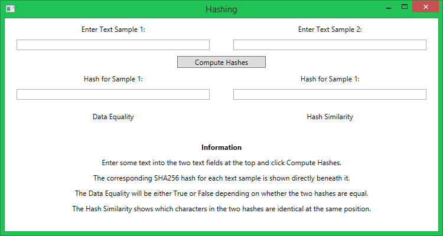
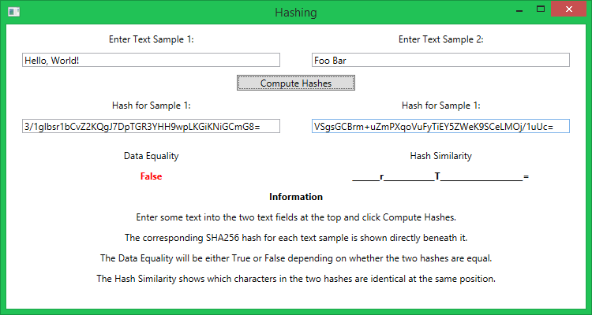

AltCoin Samples - Hashing Application
=====================================

Application Location
--------------------

If you have installed the applications using the installer, the can be found in
the **B W Hazel\AltCoin Samples** folder on the Start Menu.

Introduction
------------

The Hashing application demonstrates hashing using the SHA256 algorithm.  It
can be used to:

* Compute a hash for a specified piece of text
* Compute hashes for 2 specified pieces of text and compare them for data
equality and hash similarity.

The application will automatically perform the comparison even if only one
piece of text is entered; in this situation the comparison is between the
entered piece of text and nothing.

Usage
-----

When you start the application you are greeted with the following interface:

To perform a hash comparison enter two pieces of text into the text fields
marked **Enter Text Sample 1** and **Enter Text Sample 2**.  Then click the
**Compare Hashes** button.

If the two pieces of text were **Hello, World!** and **Foo Bar** the result
would be:

The results are shown in the following text fields:

* **Hash for Sample:** The hash of each piece of text is shown directly beneath
it in these text fields.
* **Data Equality:** Depend on whether the two hashes are equal: **True** if
they are, otherwise **False**.
* **Hash Similarity:** A direct comparison of the two hashes: if they both have
the same character at the same position it is shown, otherwise an underscore is
put in its place.