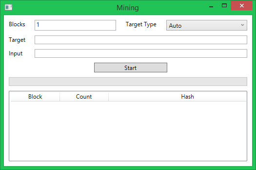
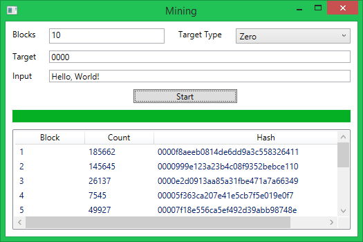

AltCoin Samples - Hashing Application
=====================================

Application Location
--------------------

If you have installed the applications using the installer, the can be found in
the **B W Hazel\AltCoin Samples** folder on the Start Menu.

Introduction
------------

The Mining application is a basic simulator of the altcoin mining process.  It
takes an input piece of text to which it appends a _nonce_ value of 0 and
computes the hash.  If the numeric representation of the hash is less than the
target the block is solved.  If not, the process is repeated, increasing the
nonce by 1 on each attempt until the block is solved.  Once solved, the
successful hash is used as the input seed for the next block.

The application uses several input parameters:

* **Blocks**: The number of blocks it should solve.
* **Target**: The value which determines whether a block is solved.
* **Target Mode**: A setting to control how the target value is set or used.  This
is a convenience to avoid having to type in a full hash value.
* **Input**: A piece of text to be used as the input seed for the mining process.

All hashes are computed using the MD5 algorithm.

Usage
-----

When you start the application you are greeted with the following interface:

Each input component is described below.

### Blocks

This is the number of blocks the simulator should solve.  The default value is
1.

### Target Type

This determines how the target should be treated by the application when it
performs a mining simulation.  The different options are:

* **Auto:** A target is set automatically according to the current date and
time.  Any value already in the **Target** field will be overwritten.
* **Limit:** This should be a 128-bit hexadecimal number, e.g.
0000ffffffffffffffffffffffffffff.  This will be used as the numeric upper
limit: if a hash is lower than this value, it will solve the block.
* **Text:** Enter any text into the **Target** field and its hash will be used
as the numeric upper limit target.
* **Zero:** This should be a string of zeros, e.g. 0000.  The computed hashes
will need to start with the same number of zeros to solve the block.

### Target

This value determines if a block is solved and should be set according to the
target type.  Examples for each type are:

* **Auto**: No target is required.  Any that is in the **Target** field will
be overwritten.
* **Limit**: 0000ffffffffffffffffffffffffffff
* **Text**: target
* **Zero**: 0000

If no value is entered, the type will default to **Auto**.

### Input

This value is optional and can be any piece of text.  If none is given, a value
is automatically set according to the current date and time.

After a simulation, the interface would look like:

The table view contains columns with information on the solved blocks:

* **Block:** The block number that was solved.
* **Count:** The number of attempts it took to solve the block.
* **Hash:** The successful hash which solved the block.